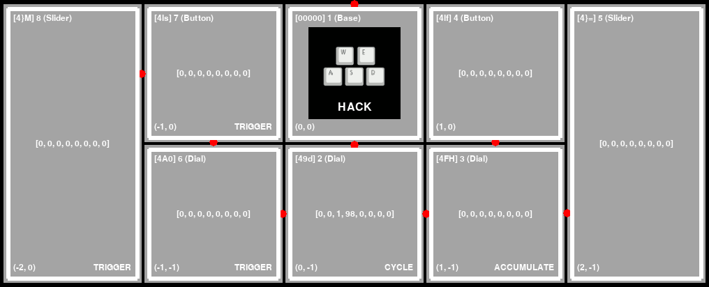

# AMBIT

**ambit** is a Python library for interacting with PaletteGear and MonogramCC devices,
a graphical simulator for device-free development, and an accompanying set of
configurable end user tools and demos.



This project is not endorsed or supported by Monogram.

Take control of your Palette.

## Features

- runs on Linux, should be portable to others
- automatic MIDI binding for all attached components
- parses PLP configuration created by PaletteApp
- create and push custom screen images to the device
- configure multiple profiles, cycle using device input
- all actions and bindings are configurable
- supports several upstream mediaMap actions
- adds `executeCommand` action and [others](docs/CONFIG.md#actionmap)
- optional graphical interface
- simulator for development without a Palette device
- [pretty, interactive LED demos](https://youtu.be/SrBNBnIsv3I)

See also: [ROADMAP.md](ROADMAP.md).

## Getting Started

You may want to familiarize with ambit's high level [docs/CONCEPTS.md](docs/CONCEPTS.md)
before diving into development or configuration.

### Build

Instructions assume a recent Debian derivative.

Ensure you have pip and virtualenv installed:

```
$ sudo apt install git python3-pip python3-venv
```

Install Python wheel build dependencies:

```
$ sudo apt build-dep python3-pygame python3-pyusb
```

Check out the repository with Git.

```
$ git clone ...
```

Create the virtualenv:

```
$ make setup
```

You can run ambit in a virtualenv without installing anything.

The `make` commands above all take advantage of this.

However, if you wish to install permanently...

Install ambit user-wide (pip) from source:

```
$ make install
```

Install ambit system-wide (pip) from source:

```
$ sudo make install
```

You can always uninstall with:

```
$ make uninstall
```

or for system-wide:

```
$ sudo make uninstall
```

### Check

View the list of available commands:

```
$ make help
```

Render a simulation (no device required):

```
$ make simulator
```

When in the simulator, you can select a component by pressing the
number of its index (1-9) on your keyboard (not numpad). Press 0 to deselect.
The index for a component can be found at it's top right corner.
In the screenshot above, the top left component `[4}m] 7 (Slider)` has
an index of `7`.

When a component is selected, use keyboard LEFT ARROW and RIGHT ARROW to
simulate Dial rotation, SPACE to simulate button press/release, and
UP ARROW and DOWN ARROW to simulate slider movement.

The TAB key can be used to rotate the layout clockwise 90 degrees.

### Hardware

If you wish to use ambit with a physical Palette device, you
will need configure udev for non-root access.

The default group for device ownership is `scanner`. If you'd prefer
to use another group, edit `99-usb-palette.rules` before copying.

```
$ sudo cp 99-usb-palette.rules /etc/udev/rules.d/
```

Ensure your user is in the group mentioned in the rules file:

```
$ sudo adduser $USER scanner
```

Reboot for changes to take effect.

Plug the device in and then [#experiment](#experiment).

If your device permissions are still incorrect, you may need to adjust
the `idVendor` and `idProduct` values.

You can determine these values with the `lsusb` command:

```
$ lsusb
Bus 003 Device 001: ID 1d6b:0002 Linux Foundation 2.0 root hub
Bus 002 Device 001: ID 1d6b:0003 Linux Foundation 3.0 root hub
Bus 001 Device 003: ID 0a5c:6412 Broadcom Corp. BCM2045A0
Bus 001 Device 033: ID 16d0:09f8 MCS Palette Multi-function Device
Bus 001 Device 001: ID 1d6b:0002 Linux Foundation 2.0 root hub
```

If you are using a newer MonogramCC device, the name shown by lsusb may differ.

In the example above, the **MCS Palette** device has `idVendor 16d0` and `idProduct 09f8`.

If you discover a new set of values, please create a new issue with a summary of
"New USB Device Identifiers" and include the output of `lsusb -v`.

### Experiment

These steps assume you've already run the steps in [#hardware](#hardware).

Run an interactive demo on a physical Palette device:

```
$ make start
```

Same as above, plus a GUI:

```
$ make start-gui
```

Run a demo with more complex behavior:

```
$ make start-layout5
```

```
$ make start-layout5-gui
```

Most "layout" targets assume a [specific layout](docs/layout.jpg).

Examine [example/configs/layout5/](example/configs/layout5/) and adjust as needed.

### Install

Note: currently this is not as well tested as [#build](#build).

Quick install via PyPI:

```
$ python3 -m pip install ambit
```

After ambit is installed, you can run it directly:

Run using a real device (CLI only):

```
$ ambit --help
```

Run using a real device (with GUI):

```
$ ambit_gui --help
```

Run a graphical simulator:

```
$ ambit_simulator --help
```

### Development

Run all tests:

```
$ make test
```

Run a specific test:

```
$ make test-integration-layout4
```

Generate test coverage report:

```
$ make coverage-report
```

Profile the simulator:

```
$ make simulator-prof
```

Run static analysis:

```
$ make lint
```

See also: [docs/HACKING.md](docs/HACKING.md).

### Demos

Turn your device into an interactive lightshow:

```
$ make demoscene
```

Press the rowwise second Button to switch between predefined demos.

Press the rowwise first Button to switch Dial control mode
between **FREQ** (red, green, blue), **PHASE** (red, green, blue), and
**META** (width, center, and length).

These values correspond to sinebow parameters. See
https://krazydad.com/tutorials/makecolors.php for a more detailed
explanation of these values.

Turn the rowwise first three dials to adjust the respective
values of the currently selected control mode.

You can also launch in the simulator:

```
$ make demoscene_simulator
```

Alternative LED demos:

```
$ make lightshow
```

```
$ make lavalamp
```

### Configuration

See [docs/CONFIG.md](docs/CONFIG.md) for config reference.

ambit can be launched with an ~unlimited number of profiles.

To switch between profiles, you will need to configure appropriate bindings.

There are examples demonstrating this in [example/configs/](example/configs/).

Reference configuration from PaletteApp is in [reference/configs/](reference/configs/).

### MIDI / HID

Map MIDI and exit:

```
$ make map_midi
```

Map HID key bindings and exit:

```
$ make map_hid
```

### Screen Images

These tools require `pygame`, which is known to not work headless on some
platforms including raspbian.

To generate custom screen images from any pygame supported image format:

```
$ ambit_image_convert <src> <dest>
```

Display a Palette screen image locally:

```
$ ambit_image_display example/assets/23.raw
```

### Appendix

You can define custom actions using one or more configs.

```
$ make simulator-layout2
```

A few sample layouts are included:

```
$ make start-layout1
```

```
$ make start-layout2
```

For more options, run:

```
$ make help
```
