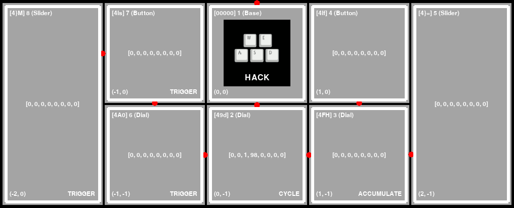

# AMBIT

**ambit** is a Python library for interacting with PaletteGear and MonogramCC devices,
a graphical simulator for device-free development, and an accompanying set of
configurable end user tools and demos.



This project is not endorsed or supported by Monogram.

Take control of your Palette.

## Features

- runs on Linux, should be portable to others
- automatic MIDI binding for all attached components
- parses PLP configuration created by PaletteApp
- create and push custom screen images to the device
- configure multiple profiles, cycle using device input
- all actions and bindings are configurable
- supports several upstream mediaMap actions
- adds `executeCommand` action and [others](docs/CONFIG.md#actionmap)
- optional graphical interface
- simulator for development without a Palette device
- [pretty, interactive LED demos](https://youtu.be/SrBNBnIsv3I)

See also: [ROADMAP.md](ROADMAP.md).

## Getting Started

You may want to familiarize with ambit's high level [docs/CONCEPTS.md](docs/CONCEPTS.md)
before diving into development or configuration.

ambit has been most heavily tested on Debian, specifically the buster and bullseye
releases. The `ambit` binary is known to run headless on RPi4 devices.

### Preparation

Throughout this document, commands which contain `simulator`
do not require a physical device. In you do not wish to use a device
at this time, you can skip to [#installation](#installation).

If you wish to use ambit with a physical Palette device, you
will need configure udev to set appropriate permissions for non-root access.

A sample rules file is included in this repository for convenience. The group
chosen for device ownership is `scanner`. If you'd prefer
to use another group, modify `99-usb-palette.rules` before copying.

Download [99-usb-palette.rules](99-usb-palette.rules) and then copy
it to the udev rules directory:

```
$ sudo cp 99-usb-palette.rules /etc/udev/rules.d/
```

Ensure your user is in the group mentioned in the rules file:

```
$ sudo adduser $USER scanner
```

Reboot for changes to take effect.

Now plug in the device and head to [#installation](#installation).
If you are not able to connect after installation, check out
[#troubleshooting](#troubleshooting).

### Installation

Install from the PyPI package repository:

```
$ python3 -m pip install ambit
```

To install from source, see [#build](#build).

### Basic usage

To verify our installation, it is best to launch ambit in
debugging mode. In this mode it will respond to user input
and log information about those inputs to the console or GUI.

If you don't have a physical device configured, you can still
run the graphical simulator:

```
$ ambit_simulator --verbose
```

For detailed simulator instructions see [#simulator](#simulator).

If you have completed the steps in [#hardware](#hardware), you can
connect ambit to a physical Palette or MonogramCC device.

To connect with a command line only interface:

```
$ ambit --verbose
```

To connect with a graphical interface:

```
$ ambit_gui --verbose
```

Throughout this document, anywhere you see an `ambit` command, you can usually
append `_gui` or `_simulator`, as in `ambit_gui` or `ambit_demoscene_simulator`.

### Advanced usage

To view full command line usage:

```
$ ambit --help
```

You can launch ambit with one or more built-in layouts:

```
$ ambit --layouts=showcase
```

**N.B.** Most built-in layouts assume that your components are in
[a specific arrangement](docs/layout.jpg).

Examine [ambit/resources/layouts/multifunction-buttons/](ambit/resources/layouts/multifunction-buttons/).

You can also create your own [#configuration](#configuration).

### Flashing

NOTE: Before flashing, you must detach all attached components except
for the base.

Palette devices use the DFU protocol for firmware upload.

To place the device in DFU mode, attach and run:

```
$ ambit_reboot_bootloader
```

Once the device is in DFU mode, you can use a tool such as `dfu-programmer` to
write any firmware to the device.

You can place factory firmware files in the directory `reference/firmware/`
with the file format `firmware-reference-<version>.hex` and flash using:

```
$ make flash-reference-<version>
```

See [docs/HACKING.md](docs/HACKING.md) for instructions on how to capture
factory firmware images.

Be aware that newer versions (1.4.6136 as of this writing) have much lower
LED and screen write performance compared with version 1.3.1.

There are convenience targets defined for LED optimized (`flash-ledopt`)
and latest version (`flash`).

NOTE: version 1.3.1 has a bug which causes the slider range to be
limited to 1-254 instead of 1-255. We work around this issue in ambit by
aliasing the 254 value to 255 when this firmware version is detected.

### Pushing Assets

NOTE: Before pushing assets, you must detach all attached components
except for the base.

Custom screen images can be added to the device.

Add screen images (PNG files) to `ambit/resources/assets/`
and run a one-time conversion/push to the device:

```
$ make push_assets
```

### Configuration

There are several configuration examples in [ambit/resources/layouts/](ambit/resources/layouts/).

See [docs/CONFIG.md](docs/CONFIG.md) for the complete config reference.

ambit can be launched with an ~unlimited number of configuration profiles. 
To switch between profiles, you will need to configure appropriate bindings.

### Demos

Turn your device into an interactive lightshow:

```
$ ambit_demoscene
```

Press the rowwise first Button to switch between predefined demos.

Press the rowwise second Button to switch Dial control mode
between **FREQ** (red, green, blue), **PHASE** (red, green, blue), and
**META** (width, center, and length).

These values correspond to sinebow parameters. See
https://krazydad.com/tutorials/makecolors.php for a more detailed
explanation of these values.

Turn the rowwise first three dials to adjust the respective
values of the currently selected control mode.

You can also launch in the simulator:

```
$ ambit_demoscene_simulator
```

Alternative LED demos:

```
$ ambit_lightshow
```

```
$ ambit_lavalamp
```

### Troubleshooting

If you followed the instructions in [#hardware](#hardware) and the simulator works,
but you are still not able to connect to a physical device, you may need to
adjust the `idVendor` and `idProduct` values in `99-usb-palette.rules`.

You can determine correct values using the `lsusb` command:

```
$ lsusb
Bus 003 Device 001: ID 1d6b:0002 Linux Foundation 2.0 root hub
Bus 002 Device 001: ID 1d6b:0003 Linux Foundation 3.0 root hub
Bus 001 Device 003: ID 0a5c:6412 Broadcom Corp. BCM2045A0
Bus 001 Device 033: ID 16d0:09f8 MCS Palette Multi-function Device
Bus 001 Device 001: ID 1d6b:0002 Linux Foundation 2.0 root hub
```

If you are using a newer MonogramCC device, the name shown by lsusb may differ.

In the example above, **MCS Palette Multi-function Device** has
`idVendor` and `idProduct` values of `16d0` and `09f8` respectively.

Each time you change udev rules, you will need to unplug and reattach your device.

If you discover a device with different IDs or you are still having difficulty connecting
to your device after following these instructions, please create a new issue with the
summary "New USB Device Identifiers" and include the output of `lsusb -v`.

### Simulator

Most ambit commands also come with a `simulator` equivalent. For example,
`ambit` has `ambit_simulator`, `ambit_demoscene` has `ambit_demoscene_simulator`.

When in the simulator, you can select a component by pressing the
number of its index (1-9) on your keyboard (not numpad). Press 0 to deselect.
The index for a component can be found at it's top right corner.
In the screenshot above, the top left component `[4}m] 7 (Slider)` has
an index of `7`.

You can loop through available components using PAGE UP and PAGE DOWN,
which can also be used to select components higher than 9.

When a component is selected, use keyboard LEFT ARROW and RIGHT ARROW to
simulate Dial rotation, SPACE to simulate button press/release, and
UP ARROW and DOWN ARROW to simulate slider movement.

The TAB key can be used to rotate the layout clockwise 90 degrees.

### Build

These instructions assume a recent Debian derivative.

Ensure you have pip and virtualenv installed:

```
$ sudo apt install git python3-pip python3-venv
```

Install Python wheel build dependencies:

```
$ sudo apt build-dep python3-pygame python3-pyusb
```

Check out the repository with Git.

```
$ git clone ...
```

Create the virtualenv:

```
$ make setup
```

You can run ambit in a virtualenv without installing anything.

The `make` commands in [#experiment](#experiment) take advantage of this.

If you wish to install permanently...

Install ambit user-wide (pip) from source:

```
$ make install
```

Install ambit system-wide (pip) from source:

```
$ sudo make install
```

You can always uninstall with:

```
$ make uninstall
```

or for system-wide:

```
$ sudo make uninstall
```

### Experiment

View the list of available commands:

```
$ make help
```

Render a no-op simulation (no device required):

```
$ make simulator
```

For instructions on using the simulator see [#simulator](#simulator).

The steps below assume you've already run the steps in [#hardware](#hardware).

You can append flags to ambit execution using the `AMBIT_FLAGS`
Makefile variable.

```
$ make AMBIT_FLAGS=--debug simulator
```

Run no-op mode on a physical Palette device:

```
$ make start
```

Same as above, plus a GUI:

```
$ make gui
```

Run a multi-function showcase:

```
$ make simulator-showcase
```

```
$ make start-showcase
```

```
$ make gui-showcase
```

### Development

Run all tests:

```
$ make test
```

Run a specific test:

```
$ make test-integration-multifunction_buttons
```

Generate test coverage report:

```
$ make coverage-report
```

Profile the simulator:

```
$ make profile-simulator
```

Run static analysis:

```
$ make lint
```

See also: [docs/HACKING.md](docs/HACKING.md).

### MIDI / HID

Map MIDI and exit:

```
$ make map_midi
```

Map HID key bindings and exit:

```
$ make map_hid
```

### Screen Images

These tools require `pygame`, which is known to not work headless on some
platforms including raspbian.

To generate custom screen images from any pygame supported image format:

```
$ ambit_image_convert <src> <dest>
```

Display a Palette screen image locally:

```
$ ambit_image_display ambit/resources/assets/23.raw
```

### Appendix

Reference configuration from PaletteApp is in
[ambit/resources/layouts/reference/](ambit/resources/layouts/reference/).

